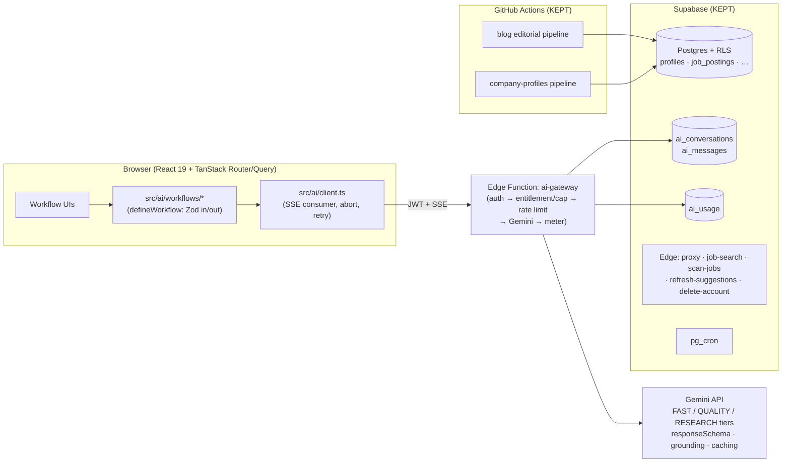

# TechCoach AI — Rebuild Development Plan

**Date:** July 2026
**Status:** Approved plan
**Companion doc:** [`ROADMAP.md`](./ROADMAP.md) — the 10x feature roadmap that builds on this foundation.

---

## 1. Executive summary

This plan treats the current application as the spec and rebuilds it into a platform that is 10x better to use (streaming, stateful, reliable AI), 10x cheaper to maintain (one AI vendor, one state model, fewer services, strict types, tests that gate CI), and ready to carry the feature roadmap (memory, agents, billing).

**Rebuild philosophy: rebuild in place via the strangler pattern, executed as a true rebuild.** Each phase replaces a subsystem *wholesale* and deletes the old one at phase exit — the deletion checklist in §8 is the definition of done. We do not greenfield (see Appendix A): the most expensive assets in this codebase are invisible — hardened RLS policies, MFA step-up (AAL2), the pentest remediation (SSRF, CORS, prompt-injection), 40 passing test suites, and two working data pipelines. A greenfield rewrite re-derives every one of those from memory and ships zero user-visible improvement for months. The genuinely rotten parts — the AI layer, routing/state, the untested UI — are concentrated and can be replaced completely without touching the good parts.

**Timeline:** 9–13 weeks for the foundation (Phases 0–4), 1–2 engineers, with the app shipping continuously. Roadmap phase R1 can begin in parallel with Phase 3.

### The headline problems this plan fixes

| # | Problem (verified in code) | Fix |
|---|---|---|
| 1 | **Dev and prod run different AI vendors.** Dev gateway (`server.ts`) shells out to the local Claude CLI; prod (`supabase/functions/ai-generate/index.ts`) remaps *both* declared model tiers to `gemini-3.1-flash-lite`. Prompts are tuned against a model that never ships. | One Gemini-only gateway, identical in dev and prod (Phase 1) |
| 2 | **No streaming anywhere.** `sendMessageStream` in `src/services/geminiService.ts` fakes streaming after awaiting the full response; time-to-first-token equals total generation time on every surface. | SSE end-to-end (Phase 1) |
| 3 | **Brittle structured output.** "Return ONLY JSON" prompts + a hand-rolled truncation-recovery parser, copied ~8 times, instead of Gemini's native `responseSchema`. | Schema-enforced output from per-workflow Zod schemas (Phase 1) |
| 4 | **CI never runs the tests.** `.github/workflows/ci.yml` gates typecheck + build + audit; the 40 vitest suites are advisory. | Tests gate CI (Phase 0) |
| 5 | **Loose TypeScript at the core.** No `strict`; the central workflow contract is `generatePrompt(data: Record<string, any>)` (`src/config/workflows.ts`) dispatched via `workflowId as any` behind a `@ts-ignore` in `App.tsx`. | Strict TS with a ratchet + typed `defineWorkflow` contract (Phases 0–1) |
| 6 | **Zero observability.** No error tracking, no product analytics, no AI token/cost/latency metrics. | PostHog + `ai_usage` metering (Phases 1–2) |
| 7 | **Live schema drift.** `supabase/pending_migrations/` holds 5 un-applied migrations — including the entire Employer Studio schema the frontend already uses — with a **timestamp collision** against applied migrations; `supabase/types.ts` is stale (missing 6 tables). | Ground-truth phase (Phase 0) |
| 8 | **Fragile state layer.** Whole-profile `upsert` on every patch with a `profileRef` anti-clobber hack, in-flight AI results lost on refresh, hand-rolled hash routing, views kept mounted forever after first visit. | TanStack Router + TanStack Query (Phase 3) |

---

## 2. Simplification principles

Every architecture decision below was re-checked against one test: **fewest moving parts that still does the job**, because long-term management cost is dominated by the number of vendors, SDKs, services, and hand-rolled subsystems that must be understood, patched, and paid for.

1. **One AI provider: Gemini only.** Gemini covers every capability this product needs in a single SDK — search grounding, native `responseSchema` structured output, SSE streaming, context caching — and it is already the prod vendor, so there is no migration and no old-vs-new vendor eval matrix. One vendor, one bill, one SDK version to track.
2. **One new frontend dependency for state, not three.** TanStack Query for server state (its cache, retries, and optimistic updates directly kill the profile-upsert race hack and the keep-views-mounted hack). No Zustand — the existing two contexts plus local state suffice. TanStack Router replaces the hand-rolled hash router because it *deletes* custom code rather than adding a layer.
3. **One observability vendor: PostHog** — product analytics, error tracking, and dashboards over the `ai_usage` table. No Sentry, no custom dashboard app. Free tier covers current scale.
4. **Fewer deploy units.** Edge functions consolidate 9 → 6 (§6, Phase 1); the dev Express server's AI path is deleted outright.
5. **Prompts and evals live in code**, versioned in git like everything else. No prompt database, no eval SaaS — a typed registry module and a vitest suite over golden fixtures.
6. **Delete the in-browser ONNX TTS stack.** Kokoro drags `@huggingface/transformers`, self-hosted WASM binaries, and COOP/COEP isolation config through `vite.config.ts` — the single largest build-config complexity in the repo. Default voice becomes browser `speechSynthesis`; cloud TTS (the existing `/api/tts` proxy path) becomes the premium voice, a paid-tier perk. *Tradeoff accepted: default voice quality drops.*
7. **One cron surface per concern.** GitHub Actions only for repo-writing content pipelines (blog, company profiles); pg_cron only for DB-facing jobs (suggestions, research seeding, and later nudges/digests). No new automation outside these two.
8. **Supabase primitives only.** No self-hosted queues, vector databases, or Redis. Rate limiting stays on the existing `ai_rate_limits` DB-counter pattern (the Upstash idea in `docs/REMAINING_WORK.md` §4 is retired — one less vendor).

---

## 3. The current app is the spec

Feature parity is the floor for this rebuild. The 21 features below must all work at cutover; none are dropped (behavioral changes are Roadmap territory).

| # | Feature | Key entry points |
|---|---|---|
| 1 | Dashboard (pipeline table, funnel stats, nudges) | `src/components/Dashboard.tsx` |
| 2 | Goal Planner (intake, survey, coaching chat, milestones, saved plans) | `src/components/GoalPlanningWorkspace/` |
| 3 | Job Postings (ATS scan, aggregators, import-from-URL, weekly suggestions) | `src/components/JobPostingsWorkspace/`, `supabase/functions/scan-jobs`, `job-search`, `refresh-suggestions` |
| 4 | Application Autopilot (batch tailored packages) | `src/components/AutopilotWorkspace/`, `src/services/applicationAutopilot.ts` |
| 5 | Resume Builder (multi-step form, templates, editor, PDF/DOCX export) | `src/components/ResumeGenerationForm/`, `DocumentEditor/` |
| 6 | Resume Analysis (ATS score) & JD Tailoring | `ResumeAnalysisWorkspace`, `TailorResumeWorkspace` |
| 7 | Cover Letter | `src/components/CoverLetterWorkspace.tsx` |
| 8 | LinkedIn Optimization (PDF analysis + screenshot highlighting) | `LinkedInOptimizationWorkspace`, `api/screenshot.ts` |
| 9 | Networking & Outreach tracker | `src/components/NetworkingWorkspace/` |
| 10 | Mock Behavioral Interview (voice, STAR scoring, history) | `src/components/MockInterviewWorkspace.tsx` |
| 11 | Negotiation Roleplay (scored) | `NegotiationRoleplayWorkspace.tsx` |
| 12 | Company Research (grounded, 2-tier cache) + deterministic Company Browser | `src/components/companyResearch/` |
| 13 | Market Compensation (BLS-grounded viz) | `MarketCompensationViz.tsx` |
| 14 | Salary Negotiator (offer parsing, scripts) | workflow `salary` |
| 15 | Interview & Job Search Guide | workflow `interview` |
| 16 | Global Coach Chat | `GlobalChatPanel.tsx` *(stateless today — rebuilt in Roadmap F1)* |
| 17 | Public Blog + 3-agent editorial pipeline | `src/components/BlogPage/`, `scripts/blog/` |
| 18 | Blog Admin (drafts, scheduling) | `src/components/BlogAdmin/` |
| 19 | Employer Studio (listings, AI copy, Boost) | `src/components/EmployerStudio/` |
| 20 | Onboarding wizard + resume import (PDF/DOCX) | `src/components/onboarding/` |
| 21 | Auth, MFA (AAL2 step-up), profile/security settings, account deletion | `src/context/AuthContext.tsx`, `supabase/functions/delete-account` |

Also part of the spec, unchanged: RLS on every user table, the MFA step-up model (`session_aal_ok`), prompt-injection wrapping (`uc()`), SSRF-safe fetching (`_shared/safe-fetch.ts`), CORS fail-closed, the `.npmrc` `ignore-scripts` supply-chain posture, and both data pipelines (`scripts/company-profiles/`, `scripts/blog/`).

---

## 4. Keep / Replace decision matrix

| Layer | Verdict | Reasoning |
|---|---|---|
| Supabase (auth, Postgres/RLS, Storage, Edge Functions, pg_cron) | **KEEP** | The backbone. Replacing it forfeits hardened RLS, MFA AAL2, and the pentest remediation — the most expensive things here to recreate. |
| React 19 + Vite 6 + Tailwind 4 | **KEEP** | Current, fast, no upside to switching. |
| Hand-rolled hash routing (`viewFromHash` in `App.tsx`) | **REPLACE → TanStack Router** | Typed routes, real URLs (blog/landing become indexable), route-level code splitting, and it deletes the keep-views-mounted-after-visit hack via loaders + Query cache. |
| Context-only state | **AUGMENT → TanStack Query** for server state; keep the two contexts; **no Zustand** | Query's cache + mutations kill the whole-profile-upsert `profileRef` hack in `UserProfileContext.tsx` and give persistence-across-navigation for free. |
| AI layer (`geminiService.ts`, `server.ts` AI path, `ai-generate`) | **REPLACE ENTIRELY** | Phase 1. This is the 10x lever. |
| Vercel `api/` functions (`screenshot.ts`) | **KEEP (contained)** | Screenshots need Chromium, which Supabase Edge can't run. It stays the *only* thing in `api/`; nothing new lands there. |
| Kokoro in-browser TTS (+ WASM/COOP/COEP config) | **DELETE** | §2 principle 6. `speechSynthesis` default, cloud TTS premium. |
| shadcn/base-ui component layer | **KEEP, systematize** | Tokenize the palette, migrate the 2,644 inline `style={{}}` objects, dedupe the two `StylePanel`s and duplicated spinners. |
| Data pipelines (company profiles, blog editorial) | **KEEP** | They work and seed the data moat. Only change: their prompts move into the prompt registry. |
| TypeScript config | **REBUILD → `strict: true`** | With a CI ratchet (error budget may only decrease) so the burn-down never regresses. |

---

## 5. Target architecture

Dev = prod: locally, `npm run dev:functions` runs `supabase functions serve` so the browser talks to the **same** `ai-gateway` code with the same Gemini key. `server.ts`'s AI path is deleted; its remaining proxies (TTS) move into the consolidated `proxy` function or die with the Kokoro deletion.

---

## 6. Phases

Sizing assumes 1–2 engineers; ranges are calendar weeks. Every phase ends with `npm run lint`, `npm test`, `npm run build` green and the phase's deletions merged.

### Phase 0 — Ground truth (1–2 weeks)

No user-visible change; unblocks everything else.

1. **Resolve schema drift.**
   - Renumber the 5 files in `supabase/pending_migrations/` to post-date the newest applied migration (the collision is real: pending `20260623000000_add_account_type.sql` vs applied `20260623000000_add_blog_posts.sql`); apply them; delete `pending_migrations/`. This lands the Employer Studio schema (`employer_company_profiles`, `employer_job_listings`, `employer_boost_orders`) the frontend already calls.
   - Author the missing blog-scheduling migration (`blog_posts.scheduled_for` column + `status='scheduled'` in the check constraint) that `src/services/blogAdminService.ts` already assumes.
   - Regenerate `supabase/types.ts` (`supabase gen types`) — it currently misses 6 tables and still lists the superseded `job_applications`. Add a CI step that regenerates and diffs, failing if stale.
2. **CI runs the tests.** Add `npm test` to `.github/workflows/ci.yml` as a required step (the 40 suites run in ~2s).
3. **Tooling.** ESLint (`typescript-eslint` strict-type-checked) + Prettier; flip `tsconfig.json` to `strict: true` behind a ratchet: a committed error-count baseline that CI asserts may only decrease.

**Exit criteria:** `supabase/migrations/` is the single source of truth (no `pending_migrations/`); `npm test` required in CI; `types.ts` regenerated + staleness check; ESLint baseline committed; strict-mode error count ratcheting down.

### Phase 1 — AI Core v2 (3–4 weeks) — the heart

New code lives in `src/ai/` (client) and `supabase/functions/ai-gateway/` (server). The old `src/services/geminiService.ts` (1,079 lines) and `server.ts` AI path are deleted at exit.

1. **One gateway, dev == prod.** `ai-gateway` edge function serves both environments (`supabase functions serve` locally). It authenticates the Supabase JWT, checks the per-user cap and rate limit (existing `check_ai_rate_limit` RPC), calls Gemini, meters usage. No model-name remapping — the request carries an explicit tier.
2. **Real model tiers** in `src/config/models.ts`: `FAST = gemini-3.1-flash-lite`, `QUALITY = gemini-3.5-flash`, `RESEARCH = grounded flash` (per-workflow assignment validated by evals, not vibes; exact ids re-checked at implementation).
3. **Native structured output.** Each workflow declares a Zod schema; the gateway converts it to Gemini `responseSchema`; the client parses the result with the same schema. The hand-rolled truncation-recovery parser (`parseLooseJsonObject` and its ~8 call-site copies) is deleted.
4. **SSE streaming end-to-end.** The gateway streams provider tokens; `src/ai/client.ts` exposes `streamWorkflow()` with abort, retry-before-first-token (keeping today's good `postToGatewayRaw` retry semantics), and progressive rendering. *Week-1 spike: verify SSE passes un-buffered through the Vercel rewrite path in `vercel.json` — if it buffers, the client calls the Supabase functions URL directly (CORS already supports it).*
5. **Typed workflow contract.** `defineWorkflow<TInput, TOutput>({ id, tier, inputSchema, outputSchema, buildPrompt })` in `src/ai/workflows/*` (one module per workflow) replaces the `workflows.ts` monolith and its `Record<string, any>` contract; the `workflowId as any` cast in `App.tsx` becomes impossible. Prompt-injection wrapping (`uc()`) moves into the shared prompt builder so no workflow can forget it.
6. **Prompt registry + eval harness.** Prompts get ids + versions in the registry module. `scripts/evals/` holds golden input fixtures per workflow; a vitest suite asserts schema validity and rubric-level expectations. **Evals gate any tier/prompt change** — run before/after and diff. The blog and company-profile pipeline prompts (`src/config/blogPrompts.ts`) migrate into the same registry.
7. **Conversation persistence.** New tables `ai_conversations` and `ai_messages` (owner-only RLS, per the `job_postings` template), used by every chat surface — this is the substrate Roadmap F1 builds on, and it fixes "refresh loses the in-flight result" (`docs/REMAINING_WORK.md` §5) for chat surfaces.
8. **Metering + hard cap from day one.** Every call writes `{user_id, workflow_id, model, input_tokens, output_tokens, latency_ms, ttft_ms, est_cost}` to a new `ai_usage` table. The gateway enforces a configurable hard monthly per-user token cap (cheap insurance until billing lands in Roadmap F4).

**Exit criteria:** `geminiService.ts` and `server.ts` AI path deleted; all 21 features on the new core; dev and prod provably run the same models (CI assertion); TTFT p50 < 1.5s on chat surfaces; zero JSON-recovery code paths; eval suite green on every workflow; every AI call metered.

### Phase 2 — Observability & quality gates (1–2 weeks)

1. **PostHog**: error tracking (with route-level error boundaries), the activation funnel (signup → onboarding-complete → first-resume → first-application → first-interview), and cost/latency dashboards fed by `ai_usage`.
2. **Component tests**: vitest + jsdom + Testing Library for the top 5 workflow UIs (resume builder, job postings, goal planner, mock interview, coach chat).
3. **E2E smoke**: Playwright (Chromium is preinstalled in CI images) against a seeded local Supabase — signup → onboard → generate resume → export PDF; coach chat round-trip. Required in CI.

**Exit criteria:** unhandled prod errors visible within a minute; funnel + AI cost dashboards exist; E2E smoke required in CI.

### Phase 3 — App shell & state (2–3 weeks)

1. **TanStack Router** with real paths (`/app/dashboard`, `/blog/:slug`, …) and permanent redirects from legacy `#/` hashes; route-level code splitting replaces the `visitedWorkflows` keep-mounted hack.
2. **TanStack Query** wraps the 19 `src/hooks/use*.ts` data hooks; profile updates become per-field mutations with optimistic updates — the whole-row `upsert` and the `profileRef` mirror in `UserProfileContext.tsx` are deleted.

**Exit criteria:** no hash URLs (redirects verified); hard refresh anywhere restores full state; profile save races impossible by construction; memory no longer grows with navigation.

### Phase 4 — UI system & decomposition (2–3 weeks, parallelizable with Roadmap R1)

1. **Design tokens** (the `src/index.css` palette exposed through Tailwind theme) replace inline styles view-by-view, worst offenders first: `MockInterviewWorkspace.tsx` (1,209 lines / 23 `useState`), `Dashboard.tsx` (982), `LandingPage.tsx` (943), `MarketCompensationViz.tsx` (775).
2. **Decompose** per the existing spec (`docs/superpowers/specs/2026-06-10-component-decomposition-design.md`); dedupe the two `StylePanel`s and the duplicated spinners in `App.tsx`.
3. **A11y baseline**: focus traps for modals/drawers, labels, live regions for streaming output; axe-core check in CI on core routes (full pass = Roadmap F9).
4. **Delete the Kokoro/ORT WASM machinery** from `vite.config.ts` and `src/services/kokoro*`; wire `speechSynthesis` default + cloud-TTS premium path.

**Exit criteria:** inline-style count ratchet < 300; no component > 400 lines; axe-core gate on core routes; `@huggingface/transformers`, `kokoro-js`, and the COOP/COEP config gone from the build.

---

## 7. Team split and parallelism

With 2 engineers: engineer A owns Phases 1–2 (AI core, observability) then Roadmap R1 (coach, streaming surfaces); engineer B owns Phases 0, 3, 4 (ground truth, shell, UI). The one collision point is `GlobalChatPanel.tsx` — it is **rebuilt, not refactored**, on the new core (Roadmap F1), so neither track edits the legacy file.

---

## 8. Cutover & deletion checklist

The rebuild is done when these no longer exist:

- [ ] `src/services/geminiService.ts` (replaced by `src/ai/`)
- [ ] `server.ts` AI generation path (dev uses `supabase functions serve`)
- [ ] `supabase/functions/ai-generate/` (replaced by `ai-gateway`)
- [ ] `supabase/functions/bls/`, `stock-history/`, `fetch-url/` as separate functions (merged into `proxy`)
- [ ] `supabase/pending_migrations/`
- [ ] Hand-rolled hash routing (`viewFromHash`, `handleSelectView`, `visitedWorkflows` in `App.tsx`)
- [ ] Whole-profile `upsert` + `profileRef` in `UserProfileContext.tsx`
- [ ] `parseLooseJsonObject` and every "return ONLY JSON" recovery path
- [ ] Kokoro/ORT WASM: `src/services/kokoro*`, COOP/COEP + WASM config in `vite.config.ts`, `@huggingface/transformers`, `kokoro-js`
- [ ] The `Record<string, any>` workflow contract and the `workflowId as any` cast
- [ ] Stale `supabase/types.ts` entries (`job_applications`)

---

## 9. Cost model

*All prices as of July 2026 — re-verify at implementation.*

### Staged path (free tiers first)

| Stage | Monthly fixed | Notes |
|---|---|---|
| Rebuild + private beta | **$0** | Supabase Free covers everything used (Postgres/RLS, TOTP MFA, Storage, Edge Functions, pg_cron — caveats: 7-day inactivity pause, no backups). Vercel Hobby is fine while non-commercial. Gemini free tier for **dev/CI evals only** — Google may train on free-tier data, so production user content (resumes, salary data) never goes through it; prod uses the paid tier from day one (cost below is pennies). |
| Public launch (real users) | **~$25 + AI usage** | Supabase Pro $25/mo the day there are users whose data needs backups. |
| Monetization ships (Roadmap F4) | **~$45–65 + usage** | Vercel Pro $20/mo is *required* at this point — Hobby prohibits processing payments. PostHog (1M events) and Resend (3k emails) free tiers still cover early scale; Stripe is percentage-only. |

### AI variable cost (the one that scales)

Gemini list prices: 3.1 flash-lite $0.25 / $1.50 per M tokens (in/out); 3.5 flash $1.50 / $9. Context caching and batch (~50%) available.

- Typical active seeker ≈ 50 generations/month (~150k in / 50k out): **≈ $0.11/user/mo** on flash-lite; **≈ $0.60–0.90/user/mo** with QUALITY workflows on 3.5-flash.
- Staying Gemini-only avoids the ~$1.20+/user/mo a Claude-Sonnet QUALITY tier would have cost, plus permanent dual-vendor overhead.
- **Watch item:** the stateful coach (Roadmap F1) multiplies chat-turn tokens 3–5x via injected memory/context. Mitigations are in the design: context caching, memory summarization, per-tier quotas (F4), and the Phase-1 hard cap.

### Engineering cost

Phases 0–4: 9–13 weeks (1–2 engineers). Roadmap R1–R2: ~10–12 weeks more. The simplification decisions (§2) are what brought the foundation down from an original 11–16 week estimate: no vendor migration, no dual-provider eval matrix, one observability integration, no extra state library. Every vendor/library *not* adopted (Anthropic SDK, Sentry, Zustand, Upstash, Kokoro) is permanent maintenance surface not carried.

---

## 10. Risks & mitigations

| Risk | Mitigation |
|---|---|
| Migration timestamp collision applies out of order and corrupts an environment | Phase 0 renumbers before anything else touches the DB; Roadmap F4/F7 are hard-blocked on Phase 0. |
| Tier/prompt changes silently shift output quality | Eval harness lands *before* any tier reassignment; evals gate every prompt/tier PR. |
| SSE buffered by the Vercel proxy path | Week-1 spike in Phase 1; fallback is calling the Supabase functions URL directly. |
| Coach/streaming features multiply AI spend before billing exists | Hard per-user monthly cap ships inside the Phase-1 gateway; `ai_usage` makes spend visible from day one. |
| Two tracks colliding in the same files | §7 split; `GlobalChatPanel.tsx` rebuilt, not refactored. |
| Kokoro deletion degrades the interview voice experience | Accepted tradeoff, reversible: the TTS interface stays behind `useSpeech`/`ttsService`; premium cloud voice restores quality for paying users. |

---

## Appendix A — Why not greenfield

A literal from-scratch rewrite was considered and rejected:

- **Time to parity:** 21 features, two data pipelines, MFA/AAL2 auth, and an employer mode ≈ 5–6 months of rebuild before the first user-visible improvement. The strangler plan ships streaming + reliability wins inside a month.
- **Security regression risk:** the RLS policies, `SECURITY DEFINER` helpers, SSRF-safe fetcher, CORS fail-closed behavior, and prompt-injection wrapping encode a pentest's worth of fixes (`docs/superpowers/specs/2026-06-24-security-pentest-report.md`). Greenfield re-derives them from memory — historically the way regressions happen.
- **The rot is concentrated:** the AI layer, router/state, and styling debt are replaceable subsystems. Nothing about the data model, auth, or pipelines needs rewriting.
- **Same destination:** because each phase deletes the old subsystem at exit (§8), the end state is indistinguishable from a greenfield rebuild — minus the parity gap and the regression risk.

## Appendix B — Supersedes

- `docs/REMAINING_WORK.md`: items 1 (decomposition) and 2 (inline styles) → Phase 4; 3 (streaming) → Phase 1; 4 (rate limiting) → retired in favor of the existing DB-counter pattern + Phase-1 caps (no Upstash); 5 (persist in-flight results) → Phase 1 (chat) and Phase 3 (Query cache); 6–8 → folded into Phases 3–4 and Roadmap F9. Mark that doc historical once Phase 0 merges.
- `docs/PRODUCT_DIFFERENTIATORS.md`: its three retention pillars survive as the roadmap thesis; items #1–#3 and #5–#6 are since-built or superseded by Roadmap F1/F3/F5; item #4 (coach memory) is Roadmap F1. Mark historical alongside.
